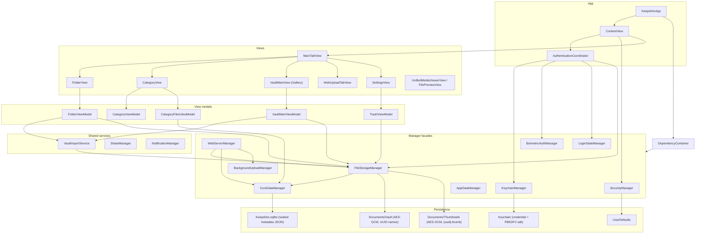
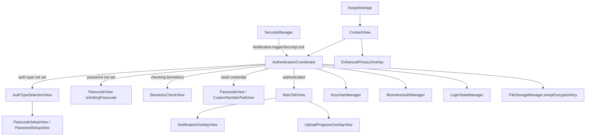
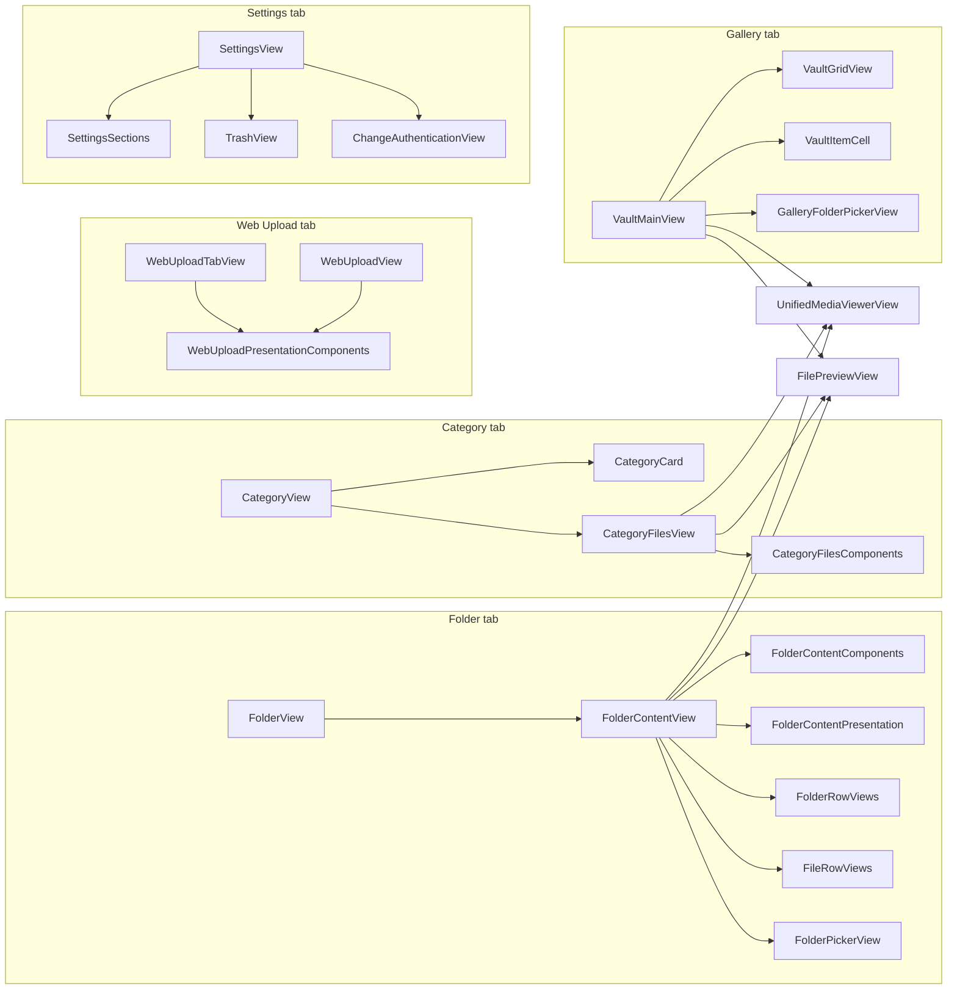
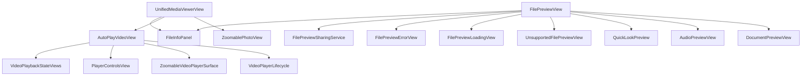
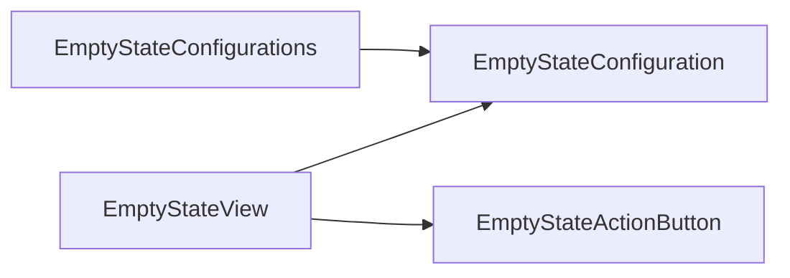
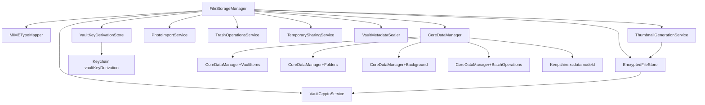
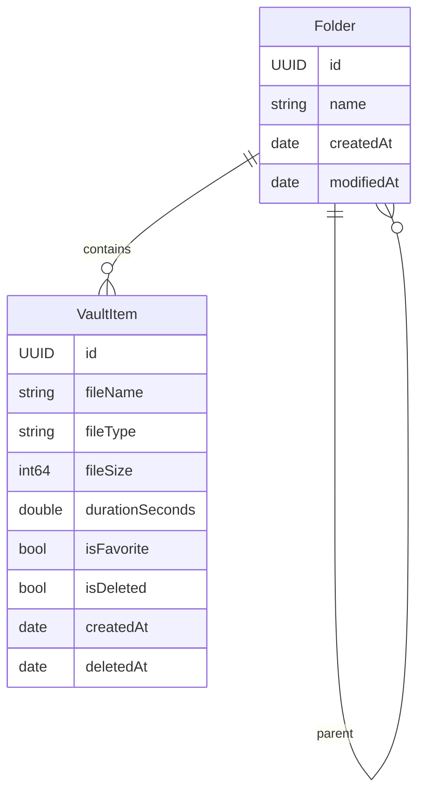
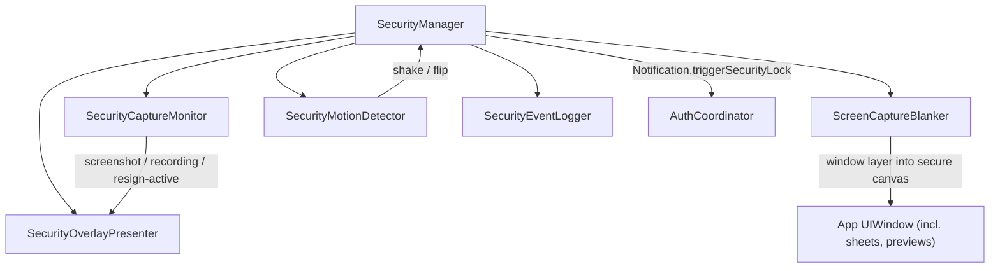
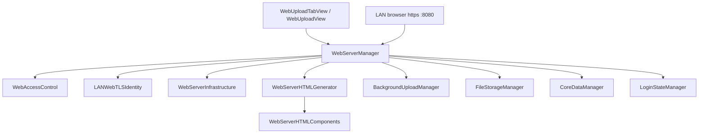
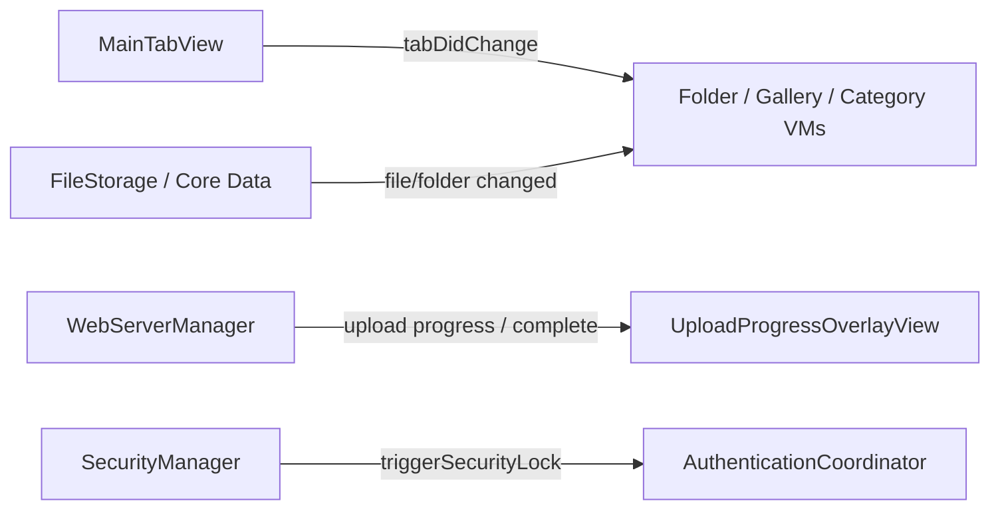

# Component graph

How Keepshire is composed. `FileStorageManager`, `CoreDataManager`, `SecurityManager`, and `WebServerManager` are the public manager entry points; focused files behind them do the work.

## 1. Runtime layers

## 2. Authentication and lock

`ContentView` owns the gate. `AuthenticationCoordinator` owns first-launch, biometric delay/fallback, scene-phase auto-lock, fake-login reset, and encryption-key setup. `SecurityManager` can post `.triggerSecurityLock`.

## 3. Tab UI components

Shared list/grid pieces: `VaultToolbarView`, `VaultItemCell`, `VaultGridView`, `UniversalAddContentView`, empty-state files, sort/folder pickers.

### Media and document preview

### Empty states

## 4. Storage and Core Data

`FileStorageManager` implements `FileStorageManaging` and delegates to focused services. Byte format, vault path, and thumbnail path stay here.

## 5. Security

## 6. LAN web server

`WebServerManager` owns listener lifecycle, connections, and finite background time for active uploads. No background mode or scheduled processing task is declared. Each start creates a self-signed TLS identity (`LANWebTLSIdentity`). It tracks protected-data availability so routes that touch vault files answer with a locked-device message while the device is locked. Pure helpers live in infrastructure/HTML files.

## 7. Dependency injection

`DependencyContainer.shared` is injected on `ContentView`. Tests use `createForTesting(...)`. Many views still fall back to `.shared` on managers.

| Protocol | Production type |
|---|---|
| `CoreDataManaging` | `CoreDataManager` |
| `FileStorageManaging` | `FileStorageManager` |
| `VaultImportServicing` | `VaultImportService` |
| `KeychainManaging` | `KeychainManager` |
| `BiometricAuthManaging` | `BiometricAuthManager` |
| `LoginStateManaging` | `LoginStateManager` |
| `SecurityManaging` | `SecurityManager` |
| `WebServerManaging` | `WebServerManager` |
| `AppDataManaging` | `AppDataManager` |

View-model collaboration protocols (not DI): `SelectionManageable`, `ImportManageable`, `MediaViewerManageable`, `SearchManageable`, `AlertManageable`. `SheetManageable` and `ErrorManageable` exist in Models and are not adopted by current view models.

## 8. Cross-cutting notifications

Named in `Utilities/AppNotificationNames.swift`. Typical publishers: tab change, vault/file/folder mutations, web uploads, security lock.

